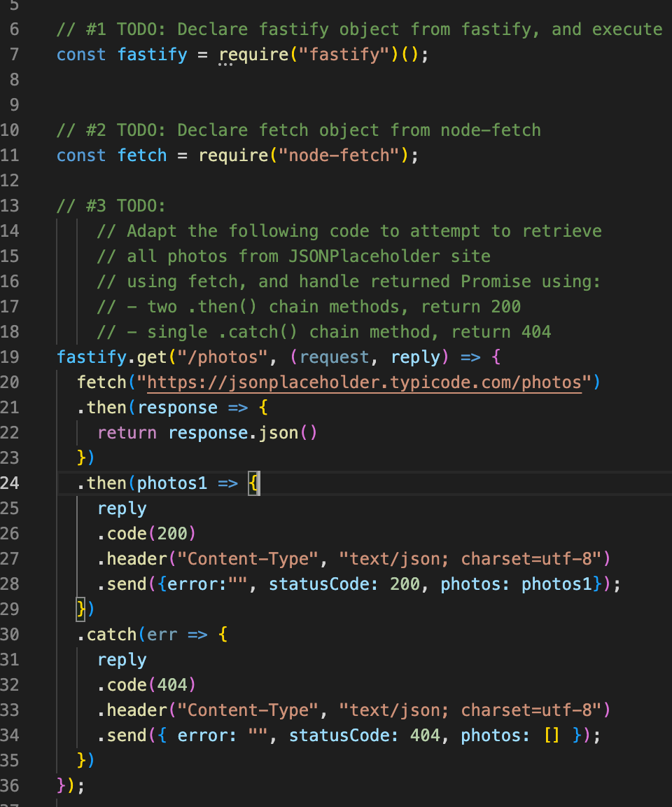

# cit281-lab-8
[cit281 lab-8](https://github.com/UO-CIT-qiqima/cit281-lab-8)

Lab 8:

1. Create lab file and initialize Node.js folder.
2. Install node-fetch package.
3. Add fastify starter code.
4. Add fastify and node-fetch require statements.
5. Fetch JSONPlaceholder data.

